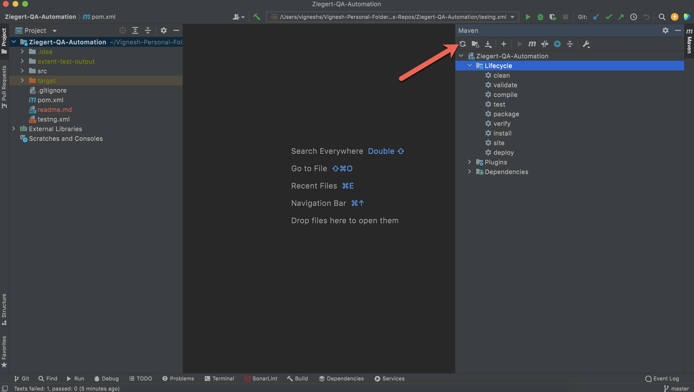
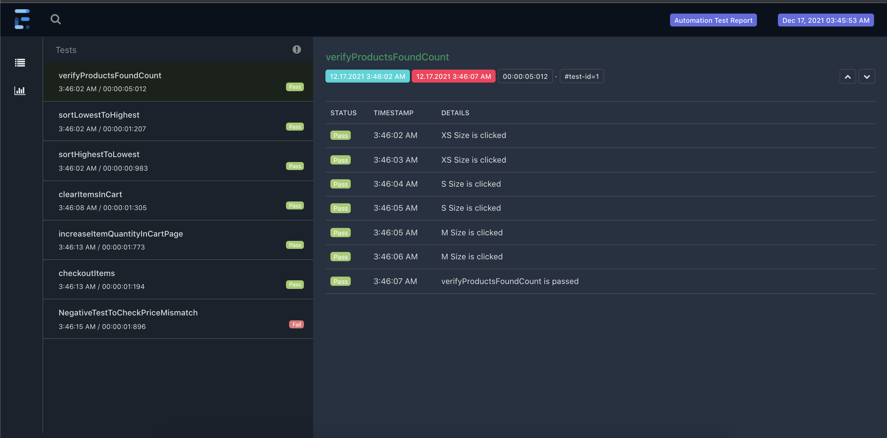

# Ziegert QA Automation Project

This repo is the **Maven-Selenium-Java** automation for the Ziegert QA Automation Project. Below have mentioned all the prerequisite and installation to run this tests.

## Prerequisite
- Java need to be installed and environment variables need to be set.

## Clone the Project

- In Terminal/Command prompt type the following
>git clone https://github.com/vignesh1810/Ziegert-QA-Automation.git

- And open the repo in any IDE

## Maven Dependency download
- Once the repo is opened in the IDE → To install all the dependencies mentioned in the pom.xml type the following
> mvn dependency:resolve
- Or other easy way is to click on the "Reload all maven project" button near to maven side bar in the IntelliJ as shown in the below image  
  

## To run Test and view Reports
- Added 6 tests → Five tests and one negative test(To display the failed screenshot in report)
- Right-click on the **testng.xml** and click on **Run../testng.xml**
- It will run all the tests and once the test execution is completed it will automatically open the report in the default browser as below  
  

## Project Folder Structure
Used Maven Project for this automation. Below its the folder structure and each file usage to the framework

### Under src/main/java
- FrameworkConstants → Use to hold constants used across framework
- Driver → To initiate and quit driver during test execution
- Driver Manager → To manage Driver instance to support **parallel execution**
- ENUM - Config Properties → To hold Config Property Enums corresponding the config.properties file
- ENUM - WaitStrategy → To hold Wait Strategy Enums to get from User
- Driver Factory → To hold the logic of what driver to launch based on browser value from config.properties file
- ExplicitWait Factory → To hold the logic of the wait mechanism of the locators
- Listener → A class which is being listened by testng.xml which helps to trigger various action based on Test Start, Test End, Test Fails etc
- Pages → Hold different page classes. Each class contains locators and method oriented to that class
- Extent Logger → Use to log the data in the Report based on if test pass/fail/skip
- Extent Manager → To manage Extent Test instance to support **parallel execution** similar to Driver Manager
- Extent Report → To initiate and quit driver Extent Report during test execution
- Utils → As the name suggest used to hold classes which are utilities to the framework such as utility class for Reading Property file, Screenshots

### Under src/test/java
- BaseTest → As the name suggest, this is the base test to all the tests. It helps to initiate and tearDown the test. All tests should extend this Base Test
- TC01 - TC05 → Each test is to verify each flow of the application
- TC06 → Negative test which will fail as to display the screenshot in the report

### Under src/main/resources
- Config.properties → Hold the important configuration such as Url, Browser